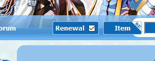

# Installation
```
npm i --save https://github.com/d4rkwizo/novaro-scraper.git
```
# Example
```
const NovaroScraper = require('novaro-scraper');

NovaroScraper.getTableData('2162', 'LIVE', (tableData) => {
  console.log(tableData);
});

// [ [ 'Price ▲', 'Refine', 'Additional Properties', 'Location' ],
//   [ '20,000,000z', '+0', 'None', 'newvending,135,142' ],
//   [ '30,000,000z', '+0', 'INT +1', 'einbroch,221,189' ],
//   [ '30,000,000z', '+0', 'INT +1', 'einbroch,221,189' ] ]

let message = NovaroScraper.toMarkdown(tableData, 'LIVE');
console.log(message);

// { title: 'Live Market Data',
//   data: '```\nPrice ▲ | Refine | Additional Properties | Location | \n30,000,000z | +0 | INT +1 | einbroch,221,189 | \n30,000,000z | +0 | INT +1 | einbroch,221,189 | \n```' }
```
# Documentation
```
/*
 * Types of tableURL.
 * @enum {string}
 */
const tableURL = {
 LIVE: 'https://www.novaragnarok.com/?module=vending&action=item&id=',
 HISTORY: 'https://www.novaragnarok.com/?module=vending&action=itemhistory&id=',
};

/*
 * @callback getTableDataCallback
 * @param {string[][]} - 2D array with format [row][cell].
 */

/*
 * Gets data from table. Callback receives a 2D array with format [row][cell].
 * @param {string} itemId - The ID of the item to be looked up.
 * @param {tableURL} tableType - One of the enumeration values.
 * @param {getTableDataCallback} callback - The callback that handles the response.
 */
getTableData(itemId, tableType, callback)

/*
 * Sets 'title' depending on 'tableType'. Builds a string with Markdown format
 * from 'tableData'.
 * @param {string[][]} tableData - Table data in the format of a 2D array [row][cell].
 * @param {tableURL} tableType - One of the enumeration values.
 * @return {{title: string, data: string}}
 */
toMarkdown(tableData, tableType)
```
# FAQ
**How to get item ID?**
- Use [this](http://ratemyserver.net/index.php?page=re_item_db).
- **Make sure** *Renewal* is checked.  

- 
